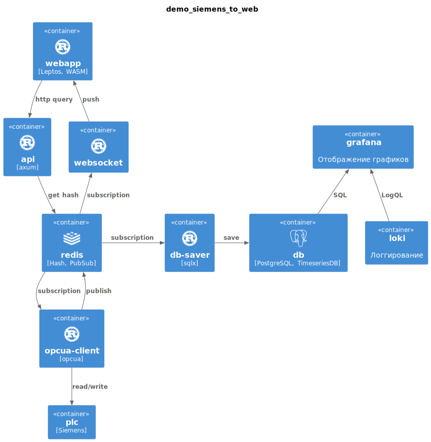

# Описание

## Краткое описание

Основной язык программирования - [Rust](https://www.rust-lang.org/). Компилируемый язык, "blazingly fast" - производительность на уровне C, только намного надежнее. Подходит для low-end устройств.

Информация во всей системе передается в виде сообщений. Изменились данные в ПЛК - по OPC UA считываются данные и публикуются в Redis. Нажали на кнопку в веб-интерфейсе - команда публикуется в Redis.

В качестве сообщений используется тип перечисления языка Rust. Пример конфигурации - `utils/messages/src/config.rs`.

## Компоненты

### redis

База актуальных данных. Используется in-memory хранилище [Redis](https://redis.io/).

При записи новых данных:

- Данные сохраняются в [хеш-таблицу](https://redis.io/docs/data-types/hashes/), откуда можно по запросу в любой момент времени получить актуальные данные по ключу.
- Данные публикуются в канале [PubSub](https://redis.io/docs/interact/pubsub/). Другие клиенты, которые подписаны на этот канал, сразу же получают новые данные и могут реагировать.

### opcua-client

Чтение и запись данных с ПЛК с использованием OPC UA.

Чтение из ПЛК. Подписываемся на изменения в ПЛК. При изменении данных ПЛК информирует сервис, данные публикуются в Redis

Запись в ПЛК. Подписываемся на сообщения из Redis. По получению сообщения изменяем данные в ПЛК.

Пример конфигурации - `services/opcua-client/src/config.rs`.

Используется библиотека [opcua-rs](https://github.com/locka99/opcua).

### api

Предоставление актуальных данных и изменение состояния по HTTP-запросам.

Используется веб-фреймворк [axum](https://github.com/tokio-rs/axum)

### webapp

Веб-приложение пользователя. Пишется на Rust и компилирутся в WebAssembly.

Пример конфигурации - `services/webapp/src/main.rs`.

Используется фреймворк [Leptos](https://leptos.dev/). Кастомизация внешнего вида - [Tailwind](https://tailwindui.com/).

### db-saver

Подписывается на сообщения из Redis и сохраняет в базу данных `db`.

Пример конфигурации - `services/db-saver/src/config.rs`.

### db

Долговременное данных в виде временн**ы**х рядов в базе [TimescaleDB](https://www.timescale.com/), созданная на основе PostgreSQL.

### grafana

Отображение сохраненных в БД данных с помощью [Grafana](https://grafana.com/grafana/) (нужен VPN).

### loki

Сбор и хранение служебных логов со всех сервисов с помощью [Loki](https://grafana.com/oss/loki/) (нужен VPN).

